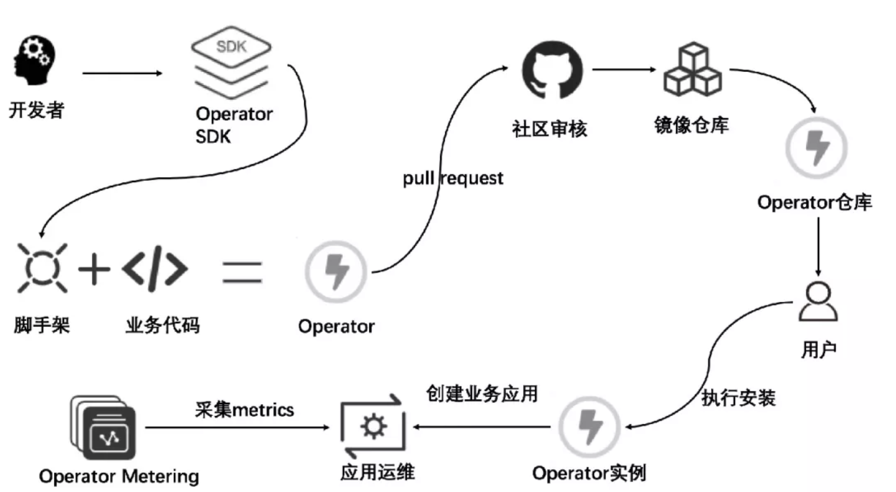

**operator**:定义了一组**在kubernetes集群中打包和部署复杂业务应用的方法**。主要针对**有状态应用**来说，operator自身控制器中存在**业务关联的运维逻辑**，可以时刻监控应用自身状态和该应用在kubernetes集群中的关注事件，在毫秒级基于期望终态作出对监听事件的处理。用户可以通过Operator的方式扩展自己的应用，并实现与kubernetes的融合

Operator 开源生命周期流程图

**主要流程包括**：

    开发者首先使用 Operator SDK 创建一个 Operator 项目；

    利用 SDK 我们可以生成 Operator 对应的脚手架代码，然后扩展相应业务模型和 API，最后实现业务逻辑完成一个 Operator 的代码编写；

    参考社区测试指南进行业务逻辑的本地测试以及打包和发布格式的本地校验；

    在完成测试后可以根据规定格式向社区提交PR，会有专人进行 review；

    待社区审核通过完成 merge 后，终端用户就可以在 OperatorHub.io 页面上找到业务对应的 Operator；

    用户可以在 OperatorHub.io 上找到业务 Operator 对应的说明文档和安装指南，通过简单的命令行操作即可在目标集群上完成 Operator 实例的安装；

    Operator 实例会根据配置创建所需的业务应用，OLM 和 Operator Metering 等组件可以帮助用户完成业务应用对应的运维和监控采集等管理操作。

### Kubebuilder

开发Operator时，可以通过CRD定义业务相关的资源，并利用controller实现对应的业务逻辑，例如创建、删除deployment,并根据资源变化作出相应的动作。Operator和kubebuilder大同小异。

###
$ curl -L <https://go.kubebuilder.io/dl/2.3.1/${os}/${arch}> | tar -xz -C /tmp/